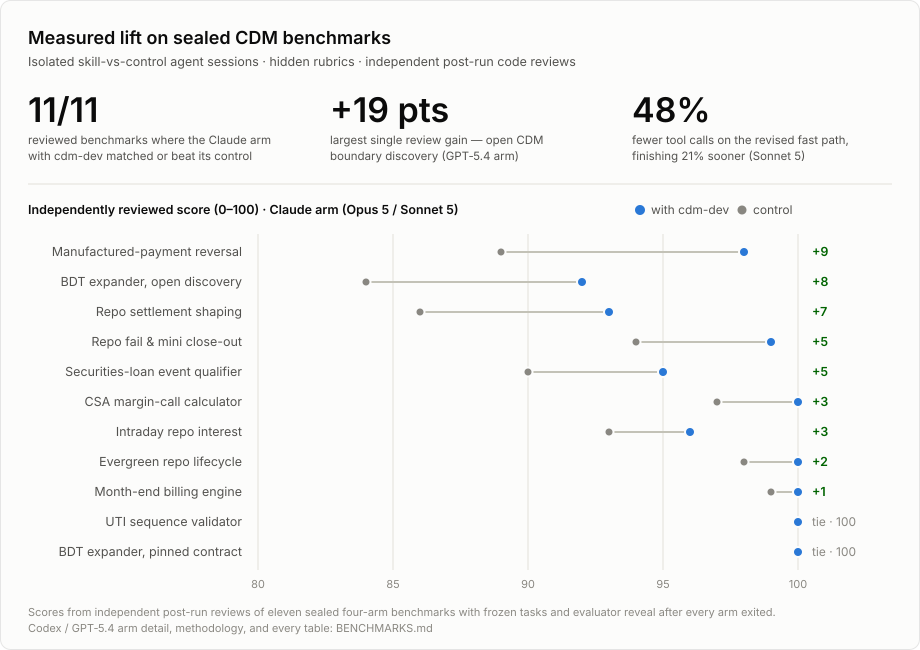

# cdm-dev

A portable agent skill for day-to-day engineering with the FINOS Common Domain Model:
Rune source, released language distributions, generated APIs, and the Rune runtime.

Point an agent at any CDM project and the skill gives it:

- **Version-matched model truth** — bounded helpers that query the exact Rune source and
  generated Java API embedded in the project's own `cdm-java` dependency, instead of guessing
  from training data or scanning JAR listings into context.
- **On-demand domain guides** — the five executable derivative asset-class families, securities
  financing, transferable assets and cash securities, Digital Regulatory Reporting, and legal
  agreements, each separating CDM and DRR behavior from application policy and legal
  interpretation.
- **An [implementation-pattern catalogue](skills/cdm-dev/references/implementation-patterns.md)** —
  recurring engineering hazards distilled into cards: when to use or avoid each, which authority
  owns the decision, the proof required, and what must be rechecked on an upgrade.
- **A tested route in** — [onboarding](skills/cdm-dev/references/onboarding.md) across the Java,
  Python, TypeScript, JSON Schema, Excel, and community-generator options, with dated ISDA, ISLA,
  and ICMA market-practice material routed through
  [`references/industry-bodies.md`](skills/cdm-dev/references/industry-bodies.md).

The skill is deliberately application-neutral. It discovers the active project's structure, uses
that project's tests and build commands, and reads model truth from version-matched Rune source.
The bundled helper uses the corresponding binary `cdm-java` JAR as a Rune source container; that
does not make Java part of a Python, schema, or other application architecture. The skill does not
require a particular repository, framework, mapping layer, or service architecture.

## Quickstart

In Claude Code, install straight from the repository's plugin marketplace — updates then arrive
with `/plugin marketplace update bq-cdm-skill`:

```text
/plugin marketplace add banqora/bq-cdm-skill
/plugin install cdm-dev@bq-cdm-skill
```

The distributable skill is the `skills/cdm-dev/` directory; everything outside it is repository
tooling. For any agent that discovers skills from a directory, place or symlink it there instead:

```bash
mkdir -p .claude/skills
ln -s /absolute/path/to/this/repository/skills/cdm-dev .claude/skills/cdm-dev
```

Use the equivalent location for other compatible agents (for Codex CLI, `.agents/skills/`).
Skill installers that understand the conventional `skills/<name>/` container — such as
`npx skills add <this repository's GitHub URL>` or the Codex `$skill-installer` given the
GitHub tree URL of `skills/cdm-dev` — discover the skill directly.

Then ask for CDM work in plain words; the skill routes the rest. The same helpers also run
standalone against any contemporary `cdm-java` JAR:

```bash
skills/cdm-dev/scripts/cdm-find --jar path/to/cdm-java.jar repurchase date
skills/cdm-dev/scripts/cdm-inspect --jar path/to/cdm-java.jar TradeState TransferState Money
skills/cdm-dev/scripts/cdm-docs only exists direction identity
```

Requirements: Bash, Python 3.10+, `rg`, `zipinfo`, and `unzip`; a JDK for the generated Java API
helper.

## Why use this skill?

A capable general agent can eventually reconstruct CDM behavior from raw distributions. `cdm-dev`
supplies the short, repeatable route: identify the owning layer, query version-matched Rune
source, inspect only the generated evidence that applies, and prove the change with a meaningful
positive test plus a close negative control.

<picture>
  <source media="(prefers-color-scheme: dark)" srcset="assets/benchmark-summary-dark.svg">
  
</picture>

Across eleven sealed four-arm benchmarks — isolated skill and control sessions, hidden rubrics,
evaluators revealed only after every arm exited — the Claude arm using `cdm-dev` matched or beat
its control in every independently reviewed pairing, and the open-boundary discovery task produced
a nineteen-point review gain for the GPT‑5.4 arm. A six-arm rerun of the event-qualifier benchmark
on the revised skill then improved all three matched model pairs, including fifteen strict-rubric
points each for Claude Opus 5 and GPT‑5.4. Where the skill wins, it wins on model-semantic
correctness: version-correct topology, generated-validator sweeps, and green-but-wrong fixtures
caught before they ship. The complete run-by-run record — methodology, every table, both vendors'
arms, and the costs alongside the wins — is in [BENCHMARKS.md](BENCHMARKS.md).

## Route to one bundled guide

Search the distributable guidance without loading all of its references:

```bash
skills/cdm-dev/scripts/cdm-docs only exists direction identity
```

`cdm-docs` searches only the active skill's `SKILL.md` and immediate `references/*.md`. It returns
at most five TSV rows and names one reference to read completely. Its root cannot be overridden, so
repository README, evals, reviews, and hidden benchmark material cannot enter the results. Treat the
output as guidance routing; prove version-specific model facts with the artifact helpers below.

## Inspect the active CDM model and Java API

When the declaration name is unknown, start with a small plain-word lookup:

```bash
skills/cdm-dev/scripts/cdm-find --jar path/to/cdm-java.jar repurchase date
```

`cdm-find` reads the embedded Rune source in memory and returns at most six ranked TSV rows: an
exact kind-qualified selector, its source location, and one matching line. It does not use regular
expressions, unpack the JAR, or print declaration bodies. Execute the helper rather than reading its
source; then run `cdm-source members` or `path` on one candidate. This keeps discovery output small
and prevents broad JAR listings from becoming model context.

For a normal Java task, inspect the complete bounded slice in one command:

```bash
skills/cdm-dev/scripts/cdm-inspect --jar path/to/cdm-java.jar \
  TradeState TransferState Money
```

`cdm-inspect` reports the exact CDM version, owning Rune declarations and functions, inheritance,
conditioned children, generated Java getters/builders, and relevant metadata and validator class
names. It accepts at most eight declarations and refuses output above 1,200 lines rather than
silently truncating it. The helper reads the embedded Rune files in one in-memory batch; it does not
unpack the JAR onto disk, download dependencies, or scan global caches.

Use the lower-level source helper for a source-only question. Its `type` path reads `.rosetta`
files directly from the binary `cdm-java` JAR. Do not pass the generated-Java `-sources.jar`; the
binary already embeds the Rune source:

```bash
skills/cdm-dev/scripts/cdm-source --jar path/to/cdm-java.jar version
skills/cdm-dev/scripts/cdm-source --jar path/to/cdm-java.jar type TradeState ClosedState
skills/cdm-dev/scripts/cdm-source --jar path/to/cdm-java.jar list 'event.*func'
```

The `type` command accepts a bounded batch of types, choices, enums, functions, and qualifications
and reads the archive once. It prints each complete declaration with inherited base declarations,
conditions, alternatives, and sibling subtypes, avoiding repeated line-window searches and broad
FpML ingestion matches. Use raw `search` only when the plain-word finder cannot locate a declaration.

`CDM_JAVA_JAR` can supply the path instead. Without either, the helper searches common
Gradle/Maven distribution and dependency-copy layouts under the active project. It refuses
an ambiguous match rather than choosing a version silently.

For exact generated Java getters and builders, inspect several types in one pass:

```bash
skills/cdm-dev/scripts/cdm-java-api --jar path/to/cdm-java.jar \
  TradeState Trade InterestRatePayout
```

For an unambiguous simple name, the helper prints the exact generated Java package; ambiguity lists
candidates instead of inviting a guessed import. It also includes each type's generated builder. If a
`com.rosetta.model.lib.*` support type is needed, add the project's already-resolved
`rune-runtime` JAR with `--classpath`; the helper never guesses or downloads a version.

## Validate

Run the structural gate:

```bash
scripts/check-skill --static
evals/check-patterns
```

Run the live contract against any contemporary `cdm-java` dependency:

```bash
scripts/check-skill --jar path/to/cdm-java.jar
```

The static gates check frontmatter, reference reachability, portability, script syntax, the size of
the always-loaded skill, implementation-card structure and provenance, and sealed forward-test
hashes. They do not claim model lift. The live skill gate also proves the source helper can read a
substantial Rosetta corpus and locate declarations the workflow relies on.

Run the script test suite (hermetic; builds its own fixture JARs):

```bash
tests/run
```

Check every external link in the Markdown resources:

```bash
scripts/check-links
```

The checker follows redirects and fails on definitive broken responses such as `404` or
`410`. It reports `401` and `403` as access warnings because some official association pages
are member-only or reject CI user agents. The GitHub workflow runs this live check on every
push to main, every pull request, and in the weekly drift sweep.

Run trigger and reviewed answer-quality evals locally through existing Claude Code and Codex
subscription logins:

```bash
evals/run-local --vendor all --check-auth
evals/run-local --vendor all --quality-only --case price-quantity-model-api
```

The local runner deliberately ignores API-key environment variables. Live model evals do not run
in GitHub Actions and require no repository secrets. See [Local skill evaluations](evals/README.md)
for authentication, focused commands, fixture caching, result review, and baseline promotion.
The twelve code-writing use cases are also preserved as leakage-aware
[implementation forward benchmarks](evals/benchmarks/README.md), with fixed tasks, hidden rubrics,
observed skill/control baselines, a shared CDM 7.0.0 seed, and `evals/check-benchmarks` validation.

Requirements: Bash, Python 3.10+, `rg`, `zipinfo`, and `unzip`; a JDK for generated Java API checks;
network access for the live link and release checks; local Claude Code and Codex CLIs for live
model evals.

## Supported CDM versions

The core workflow reads model truth from the JAR the project supplies. Domain references include
clearly dated CDM 7.0.0 observations where a concrete trap is useful, but require agents to rerun
the supplied source queries against the consuming project's version. CI proves the live helper
contract on the latest release of every supported major — currently 4.3.0, 5.40.0, 6.24.0, and
7.0.0 — and a weekly canary runs it against the newest published build (including dev builds) as
early warning before the next release enters the matrix.

## Layout

```text
skills/cdm-dev/          the distributable skill — everything an install ships
  SKILL.md               lean workflow and reference router
  references/            onboarding, product-family, legal, DRR, industry, Rune, workflow, and test guidance
  scripts/cdm-docs       route plain words to one bundled guidance reference
  scripts/cdm-find       rank a few declarations from plain search words
  scripts/cdm-inspect    inspect a bounded Rune/Java/validator slice in one command
  scripts/cdm-source     query source embedded in an active cdm-java dependency
  scripts/cdm-java-api   batch generated Java getters and builders with javap
scripts/check-skill      static and live drift gates (repository tooling)
scripts/check-links      verify external documentation links and redirects
scripts/next-version     compute the next release tag for the CI tagger
scripts/render-benchmark-summary  regenerate the README benchmark graphics
tests/                   hermetic per-tool suites (driver: tests/run; shared lib.sh, fixtures.sh)
evals/                   local runners, pattern/implementation benchmarks, graders, and baselines
BENCHMARKS.md            the complete forward-test and benchmark record behind the README summary
assets/                  README graphics (benchmark summary, light and dark)
.claude-plugin/          marketplace manifest for /plugin install in Claude Code
.github/                 hermetic lint/tests, CDM release matrix, links, and upstream canary
```
